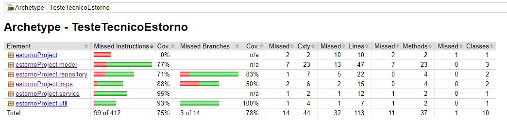

# Teste técnico normalização de arquivo de pedidos

Este projeto tem como objetivo transformar um arquivo de pedidos desnormalizado em um arquivo JSON normalizado. O programa utiliza Java e Maven para a construção e segue os padrões SOLID. Abaixo estão os detalhes sobre a estrutura do projeto, como utilizá-lo e as ferramentas empregadas.

## Estrutura do Projeto

O projeto é organizado em várias pastas, cada uma com sua responsabilidade específica:

- **imps**: Contém as implementações das interfaces.
  - `FileChooserImp`
  - `JsonConverterImp`
- **interfaces**: Contém as interfaces que definem os contratos para as implementações.
  - `FileChooser`
  - `FileReader`
  - `FileWriter`
  - `JsonConverter`
- **model**: Contém os modelos que representam os dados.
  - `Order`
  - `Product`
  - `User`
- **repository**: Leitura e escrita dos arquivos.
  - `FileDataReader`
  - `FileDataWriter`
- **service**: Realiza o processamento dos dados.
  - `DataNormalizer`
- **util**: Contém utilitários para o projeto.
  - `DateFormatter`
- **main**: Responsável por orquestrar o fluxo de execução.
- **test**: Contém as classes de testes unitários utilizando JUnit.

Além disso, o projeto possui:

- **target**: Pasta gerada pelo Maven que inclui o relatório de cobertura de testes gerado pelo Jacoco (`index.html`).
- **.github**: Pasta que contém o workflow do GitHub Actions para automação do build (`maven.yml`).
- **pom.xml**: Arquivo de configuração do Maven.

## Funcionalidades

### 1. Seleção do Arquivo de Pedidos

O programa abre uma caixa de diálogo usando `JFileChooser` para que o usuário possa selecionar o arquivo `.txt` contendo os dados dos pedidos para serem normalizados.

### 2. Estrutura do Arquivo de Pedidos

O arquivo do sistema legado possui uma estrutura em que cada linha representa uma parte de um pedido. Os dados estão padronizados por tamanho de seus valores, conforme a tabela abaixo:

| Campo           | Tamanho | Tipo                        |
|-----------------|---------|-----------------------------|
| id usuário      | 10      | Numérico                    |
| nome            | 45      | Texto                       |
| id pedido       | 10      | Numérico                    |
| id produto      | 10      | Numérico                    |
| valor do produto| 12      | Decimal                     |
| data compra     | 8       | Numérico (yyyymmdd)         |

### 3. Normalização dos Dados

Os dados lidos do arquivo são normalizados e convertidos para uma estrutura JSON utilizando a classe `JsonConverter`.

### 4. Relatório de Cobertura de Testes

A pasta `target` contém o relatório de cobertura de testes gerado pelo Jacoco, onde `index.html` mostra a porcentagem de cobertura de todas as classes.

O projeto utiliza GitHub Actions para automatizar o processo de build. O workflow definido em `.github/workflows/maven.yml` realiza os seguintes passos:

1. Faz o checkout do repositório.
2. Configura o JDK necessário.
3. Executa os comandos do Maven para construir o projeto e rodar os testes.
4. Executa os comandos do Jacoco para a construção dos relatórios de coverage.

### JaCoCo
  - JaCoCo (Java Code Coverage) é uma ferramenta de análise de cobertura de código para aplicações Java. Ele monitora a execução de testes e gera relatórios detalhados sobre quais partes do código foram executadas durante os testes. Esses relatórios ajudam os desenvolvedores a identificar partes do código que não estão sendo testadas, permitindo melhorar a cobertura de testes e, consequentemente, a qualidade do software.

### Maven
  - Maven é uma ferramenta de automação de compilação e gerenciamento de projetos. Ele usa um arquivo de configuração chamado pom.xml (Project Object Model) para gerenciar dependências, compilar o código, executar testes e gerar pacotes distribuíveis. 

### JUnit
  - JUnit é uma framework de teste. Ele é amplamente utilizado para escrever e executar testes automatizados, ajudando a verificar se o código está funcionando conforme o esperado. JUnit permite a criação de testes unitários, onde pequenos pedaços de código são testados de forma isolada. Ele fornece anotações como @Test para indicar métodos de teste e várias assertivas para verificar os resultados esperados.
